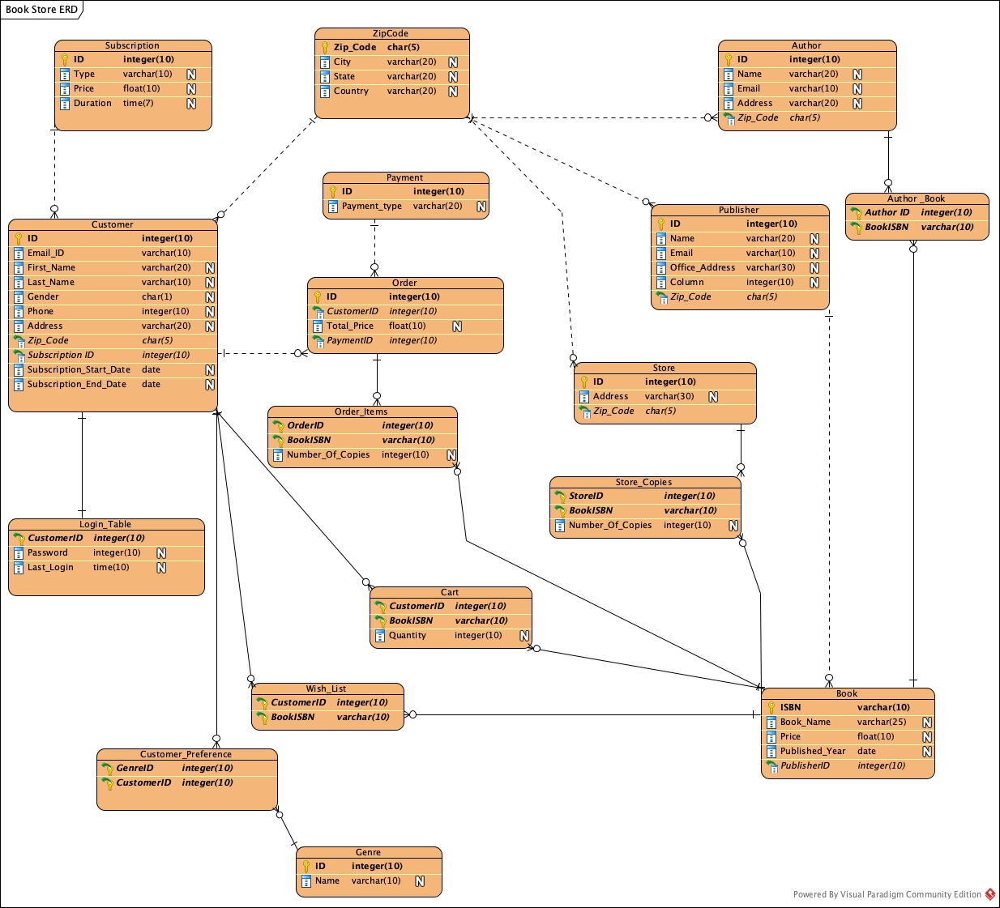

# Online-Book-Store

To run the application locally, clone the repository and run below commands inside local repo directory

```
cd src/book_store_app
python manage.py runserver
```
Application will be live at http://127.0.0.1:8000/

To install django,
```
conda install -c ananconda django
```

#### Initial ERD
